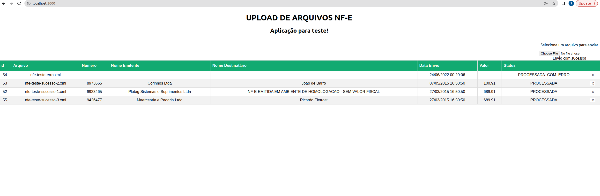
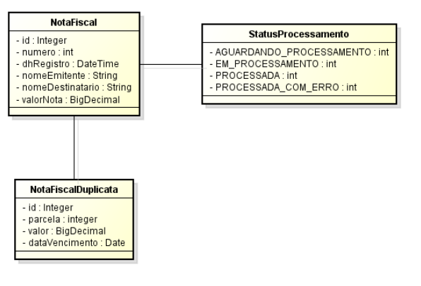
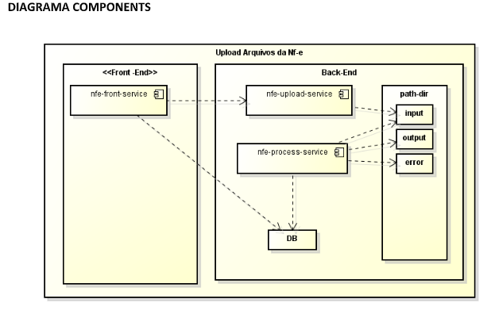

# Daniele
___________________________________________________________________________________________________________________________________________________________________

___________________________________________________________________________________________________________________________________________________________________

## How to setup project
___________________________________________________________________________________________________________________________________________________________________
**_Install requirements_**

        -Docker and Docker-compose  (last version)
        -Git (last version)

___________________________________________________________________________________________________________________________________________________________________
**_Run the application_**

Project configuration (below linux commands/feel free to use another Operations System commands similar)
- start on working directory
- Execute the command: $git clone https://github.com/srochagomes/daniele-nf.git
- acess the diretory daniele-nf/docker
- Execute command: $docker-compose build && docker-compose up (verify permission for apply 'sudo'), it could be slow to get up the aplications almost 25 minutes
- if your local enviromnent has already use one those ports 5672, 15672, 3000, 5433 and 8083, you will need to change the docker-compose file and put some free number port.
- After install, access the Application Swagger on url: http://localhost:8083/swagger-ui.html
- The Swagger can be used for execute tests on the available operations 
- The rabbitMQ should be access in http://localhost:15672 , (user:rabbitmq, pwd:rabbitmq)
- The Application should be running in http://localhost:3000/
___________________________________________________________________________________________________________________________________________________________________

**_using postgres database_ outside docker**

- jdbc:postgresql://localhost:5433/daniele_db?createDatabaseIfNotExist=true
- user:postgres
- password:postgres

_________________________________________________________________________________________________________________________________________

# Tela
___________________________________________________________________________________________________________________________________________________________________

_________________________________________________________________________________________________________________________________________

# Diagrama
___________________________________________________________________________________________________________________________________________________________________

_________________________________________________________________________________________________________________________________________

